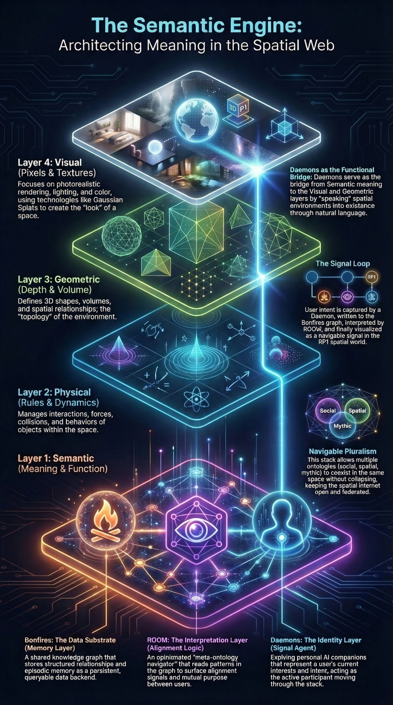

# Resonance Lab

**Field notes from the edge of the spatial web.**

A loose collaboration between three builders exploring what it means to attach meaning, memory, and personal identity to place — and surface it in a navigable spatial environment.

---



*The Semantic Engine — Bonfires (data substrate) · ROOM (interpretation layer) · Daemons (identity & signal agent)*

---

## What This Is

The emerging spatial web isn't primarily about virtual worlds. It's about **services attached to places** — software that activates based on proximity, identity, and context.

Most open-stack spatial tooling today solves rendering and geometry. The semantic layer — what a place *is*, what happened there, who cares about it — is almost entirely absent. That's the gap this collaboration addresses.

Three systems operate at the semantic layer of the spatial information stack:

| System | Role | Function |
|---|---|---|
| **[Bonfires](https://app.bonfires.ai/)** | Data Substrate | Shared knowledge graph — stores structured relationships and episodic memory as a persistent, queryable backend |
| **[ROOM](https://github.com/innercartography/ROOM)** | Interpretation Layer | Opinionated meta-ontology navigator — reads patterns in the graph to surface alignment signals and mutual purpose between users |
| **Daemons** | Identity & Signal Agent | Personal AI companions that represent a user's current interests and intent, acting as the active participant moving through the stack |

Daemons are the composable layer — they ingest spatial data from any level of the stack and generate meaning infrastructure from it in real time.

---

## The Signal Loop

```
1. Daemon emits    → user intent as structured identity signals
2. Bonfires stores → relationships written to the knowledge graph
3. ROOM detects    → alignment patterns surface from the graph
4. RP1 shows       → signals appear in the spatial environment
```

If this loop closes once, the foundation is real.

---

## Collaborators

- **Bret McCall** — Daemons · [entry log](https://bmccall17.github.io/darketype/entry.html?log=entries/2026-03-06_daemon_summons.md)
- **Joshua** — [Bonfires.ai](https://app.bonfires.ai/)
- **Mike** — ROOM · [innercartography](https://github.com/innercartography)

Built at the **RP1 Open Metaverse Hackathon**, Frontier Tower, San Francisco · March 2026

---

## Related Repositories

- **[innercartography/ROOM](https://github.com/innercartography/ROOM)** — Semantic memory layer for the spatial internet. Four ontological primitives (Place, Event, Perspective, Artifact) mirroring hippocampal architecture. Live demo at [room-openmetaverse.vercel.app](https://room-openmetaverse.vercel.app)

- **[innercartography/room-daemons-bonfires](https://github.com/innercartography/room-daemons-bonfires)** — Collaborative architecture document mapping the system design across all three components and their integration with the RP1 / MSF spatial fabric

- **[innercartography/roomhyperblog](https://github.com/innercartography/roomhyperblog)** — Cinematic hyperblog covering the ROOM project, spatial epistemology, and the philosophical grounding for semantic-layer infrastructure

---

## Key Concepts

**Navigable Pluralism** — Multiple ontologies (social, spatial, mythic) coexist in the same space without collapsing. The stack keeps the spatial internet open and federated.

**Daemons as Functional Bridge** — Daemons serve as the bridge from Semantic meaning to the Visual and Geometric layers, "speaking" spatial environments into existence through natural language (via [ManifolderMCP](https://github.com/PatchedReality)).

**Alignment Visibility** — Emerging clusters of shared intent surface before participants have explicitly found each other. Not a social network — a detection system for latent collaboration.

---

## Research

- [NotebookLM Analysis](https://notebooklm.google.com/notebook/a04f2295-25da-464c-92d4-c9479c20a098) — Resonance Lab research notebook
- [OMB Wiki](https://omb.wiki) — Open Metaverse / Metaverse Standards Forum documentation
- [RP1 Dev Center](https://dev.rp1.com) — Spatial fabric API reference
- [SensAI Hackathon](https://sensaihack.com/sanfrancisco/) — March 14–15, San Francisco

---

*Resonance Lab · Episode 02 · March 2026*
